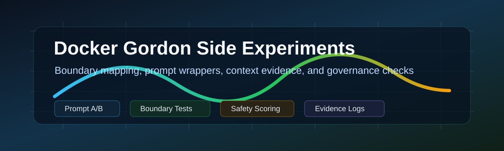

[](docs/assets/gordon-research-banner.svg)

# Docker Gordon Side Experiments

> **[繁體中文版](README.zh-TW.md)**

Research evidence for Docker Gordon / Docker AI boundary behavior, prompt wrappers, context-reading scope, and governance-layer task screening.

  

[Full Report](docs/PROJECT_EXPERIMENT_REPORT.zh-TW.md) · [Public Release Review](docs/PUBLIC_RELEASE_REVIEW.zh-TW.md) · [Context Audit](GORDON_CONTEXT_AUDIT_REPORT.md) · [繁體中文](README.zh-TW.md)

---

## Background

This repository preserves a set of Docker Desktop Gordon / `docker ai` experiments: when Gordon maps a request into a Docker workflow, whether prompt wrappers help weak Docker-surface tasks, whether unrelated tasks are rejected instead of force-fit, and whether secret-like or risky Docker requests are handled through safer governance behavior.

The repository is a research archive, not a runnable product. It keeps prompts, runners, raw results, audit logs, session evidence, and synthesis reports together so the conclusions can be inspected from the underlying artifacts.

> Note: several files intentionally contain fake canary strings and fake secret/token/key markers. They are test data, not real credentials.

---

## Findings

| Topic | Finding |
|---|---|
| Explicit Docker tasks | Docker-rich fixtures pass reliably in both baseline and treatment conditions |
| Weak Docker surface | Prompt wrappers can pull ambiguous engineering tasks back into Docker workflow mapping |
| Strong trigger semantics | `deployment readiness`, `CI parity`, `ports/logs/health`, and `reproducible dev/test/run` are especially influential |
| Non-Docker boundary | Fully unrelated tasks did not trigger tool execution or forced Docker mapping, even under strong wrappers |
| Secret / risky tasks | Final governance scoring separates actual secret-file access from textual secret mentions |
| Deferred work | Docker Desktop UI context injection and cross-model A/B remain manual/deferred |

---

## How To Read

| Goal | Start here |
|---|---|
| **Interactive boundary dashboard** | **`index.html`** (open locally or via `npx serve .`) |
| Project synthesis | `docs/PROJECT_EXPERIMENT_REPORT.zh-TW.md` |
| Research synthesis subreport | `docs/gordon-research-synthesis.zh-TW.md` |
| Public release review | `docs/PUBLIC_RELEASE_REVIEW.zh-TW.md` |
| Context-reading test manual | `GORDON_CONTEXT_AUDIT_REPORT.md` |
| Follow-up research directions | `docs/gordon-docker-next-tests-and-governance-assessment.zh-TW.md` |
| External review artifact | `test-results/GPT55PRO.md` |

---

## Experiment Data

| Path | Contents |
|---|---|
| `test-results/gordon-prompt-framework-experiment/` | Prompt architecture baseline/treatment experiment |
| `test-results/gordon-boundary-gradient-experiment-v2/` | Anchor + gradient boundary experiment |
| `test-results/gordon-boundary-gradient-experiment-v3/` | Boundary refinement, trigger ablation, wrapper minimization |
| `test-results/gordon-boundary-gradient-experiment-v3-h11-clean-rerun/` | H11 clean rerun after contamination correction |
| `test-results/gordon-non-docker-boundary-experiment/` | Fully non-Docker tasks and overforce wrapper checks |
| `test-results/gordon-final-governance-experiment/` | Chinese triggers, secret boundary, risky Docker, lexical traps |
| `test-results/gordon-session-context-ablation-experiment/` | Fresh-session, same-session, and CLI context/tool availability ablation |
| `test-results/gordon-desktop-ui-context-injection-experiment/` | Manual evidence template for Docker Desktop UI context injection |
| `test-results/docker-ai-rerun/` | Docker AI context / rerun evidence |
| `test-results/gordon-agent-layer-audit/` | AGENTS precedence and agent-layer behavior observations |

---

## Reproduce And Verify

Most runners are Python scripts that depend on local Docker Desktop / `docker ai`, Windows paths, and Docker Agent session database artifacts. Before rerunning, make sure the fixture contains no real secret files.

```powershell
# Example: inspect available experiment runners
Get-ChildItem -Recurse -Filter run_*.py test-results

# Example: read the final governance result table
Get-Content test-results\gordon-final-governance-experiment\RESULTS.md
```

> Safety note: do not place real `.env`, private keys, credentials, or production tokens inside test fixtures.

---

## Key Files

| File | Description |
|---|---|
| `index.html` | Interactive boundary dashboard (single-page, zero dependencies) |
| `gordon-boundary-map.json` | Dashboard data source (defense layers, experiments, prompt templates) |
| `docs/PROJECT_EXPERIMENT_REPORT.zh-TW.md` | Complete project experiment synthesis |
| `docs/gordon-research-synthesis.zh-TW.md` | Unit synthesis report over experiment goals, evidence, and limitations |
| `docs/PUBLIC_RELEASE_REVIEW.zh-TW.md` | GitHub public-release check and normalized external audit report |
| `GORDON_CONTEXT_AUDIT_REPORT.md` | Gordon context-reading scope test report and manual |
| `README.md` | English project entrypoint |
| `README.zh-TW.md` | Traditional Chinese project entrypoint |
| `LICENSE` | MIT License |

---

## AI-Assisted Development

This project was developed with AI assistance.

| Model | Role |
|---|---|
| OpenAI Codex | documentation synthesis, README rewrite, release review, repository inspection |
| GPT 5.5 PRO | external research review artifact preserved in `test-results/GPT55PRO.md` |

### Human Oversight

- Experiment claims are grounded in existing raw results, audit logs, reports, and transcripts.
- README and synthesis report preserve limitations instead of overstating small-sample results.
- Public-release review scans for fake secret markers, planning content, and local path exposure.
- Git changes are limited to documentation, banner, and license files.

> Disclaimer: While the author has made every effort to review and validate the AI-generated code and documentation, no guarantee can be made regarding correctness, security, or fitness for any particular purpose. Use at your own risk.

---

## License

[MIT License](LICENSE)
